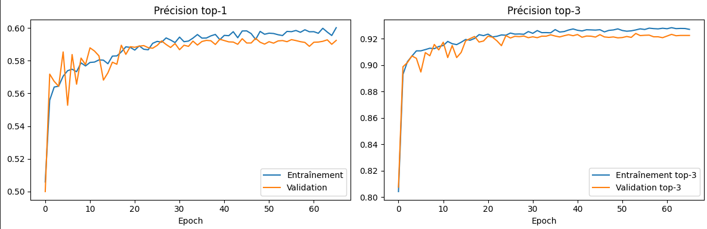
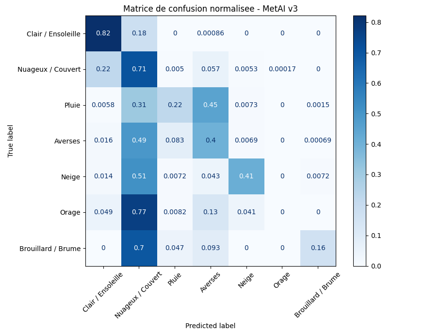
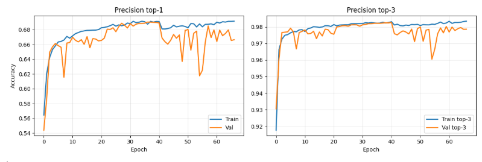

## **AI Models**  
Both models were trained in Python (TensorFlow/Keras) on historical meteorological data sourced via [Meteostat](https://meteostat.net/ "https://meteostat.net/"), using a weather station near Le Bourget du Lac, France. They take three scalar inputs:  
<table align="center">
    <tr>
        <th>Input</th>
        <th>Unit</th>
    </tr>
    <tr><td>Temperature</td><td>&deg;C</td></tr>
    <tr><td>Relative humidity</td><td>%</td></tr>
    <tr><td>Barometric pressure</td><td>hPa</td></tr>
</table>

    

### **Model A — Binary Rain Classifier**  
The first and simpler model answers a single question: **will it rain?** It outputs a sigmoid probability and is thresholded at 0.5 to produce a binary label. This model is extremely lightweight and was used as a baseline to validate the implementation of an AI model on the board. 

### **Model B — Multi-class Weather Classifier**  
The second model extends the output to **12 weather classes**, enabling a richer description of conditions. After training and quantization, it is converted to a TFLite FlatBuffer and deployed on the U545 using  **STM32Cube.AI** with the Neural-ART runtime.  
The 12 predicted classes are:  

<table align="center">
    <tr>
        <th>#</th>
        <th>French label</th>
        <th>Description</th>
        <th>International</th>
    </tr>
    <tr><td>0</td><td>Clair / ensoleillé</td><td>Clear sky</td><td>☀️</td></tr>
    <tr><td>1</td><td>Peu nuageux</td><td>Mostly sunny</td><td>🌤️</td></tr>
    <tr><td>2</td><td>Partiellement nuageux</td><td>Partly cloudy</td><td>⛅</td></tr>
    <tr><td>3</td><td>Nuageux / couvert</td><td>Overcast</td><td>☁️</td></tr>
    <tr><td>4</td><td>Pluie</td><td>Rain</td><td>🌧️</td></tr>
    <tr><td>5</td><td>Averses</td><td>Showers</td><td>🌦️</td></tr>
    <tr><td>6</td><td>Neige</td><td>Snow</td><td>❄️</td></tr>
    <tr><td>7</td><td>Neige légère / averses de neige</td><td>Light snow / snow showers</td><td>🌨️</td></tr>
    <tr><td>8</td><td>Pluie et neige mêlées</td><td>Sleet</td><td>🌨️🌧️</td></tr>
    <tr><td>9</td><td>Orage</td><td>Thunderstorm</td><td>⛈️</td></tr>
    <tr><td>10</td><td>Brouillard / brume</td><td>Fog / mist</td><td>🌫️</td></tr>
    <tr><td>11</td><td>Vent fort</td><td>Strong wind</td><td>💨</td></tr>
    <tr><td>12</td><td>Orage violent</td><td>Severe thunderstorm</td><td>🌩️</td></tr>
</table>

The firmware reads the argmax of the softmax output and encodes both the class index (predicted_class) and its French label (prediction_fr) into the LoRaWAN uplink payload.  

This model does not deliver the highest possible accuracy: predicting upcoming weather conditions from only three instantaneous meteorological measurements, without temporal context, is inherently challenging.
A key improvement would be to include additional temporal features (for example, measurements from the previous hour) to increase predictive reliability. Due to project time constraints, we could not fully validate this approach and therefore kept the current model:

    

The models were trained using the Jupyter notebooks, which are available in the `Jupyter Notebooks` folder. The training process includes data preprocessing, model architecture definition, training, and evaluation. The final TFLite model is saved as `model.tflite` and can be found in the `AI Models` folder.

# **Model C — Multi-class Weather Classifier using previous data**  

When using the model B, we quickly realized there were too many classes in order for the model to make a good prediction, therefore, the AI model wasn't performing well in terms of accuracy. To fix this, we reduced the number of classes by fusioning the ones which were alike (especially when it comes to the data of the sensor).

<table align="center">
    <tr>
        <th>#</th>
        <th>French label</th>
        <th>Description</th>
        <th>International</th>
    </tr>
    <tr><td>0</td><td>Clair / ensoleillé</td><td>Clear sky</td><td>☀️</td></tr>
    <tr><td>1</td><td>Nuageux / couvert</td><td>Overcast</td><td>☁️</td></tr>
    <tr><td>2</td><td>Pluie</td><td>Rain</td><td>🌧️</td></tr>
    <tr><td>3</td><td>Averses</td><td>Showers</td><td>🌦️</td></tr>
    <tr><td>4</td><td>Neige</td><td>Snow</td><td>❄️</td></tr>
    <tr><td>5</td><td>Orage</td><td>Thunderstorm</td><td>⛈️</td></tr>
    <tr><td>6</td><td>Brouillard / brume</td><td>Fog / mist</td><td>🌫️</td></tr>
</table>

In order to find out if reducing the number of classes actually helped we made a matrix of confusion which tells us which classes get mistaken by which.

    

As you can see the first two classes are now clearly distinct for the model which is a big improvment. However, this model is far from perfect since if you take a look at the classes such as "Orage" or "Brouillard/Brume", they are completely mistaken with "nuageux/couvert". We actually have a fex ideas in order to fix this :
1. Use the internal RTC of the U545 in order to know what time it is and where we actually are in the year. We think this would help since thunderstorm are way less likely to happen in the winter and oppositely, there is no way we are going to get snow in the summer.
2. Add some more sensors in order to improve the correlation between the sensors data and the current condition.

Not only we reduced the number of class but we also added some more inputs to the model. It still takes into parameter the pressure, humidity and temperature, however, these values are both current, from three hours ago and from six hours ago. Which makes a total of 9 inputs to the model.
We now have more inputs and less outputs which improves the accuracy of the model by 20 % !

    

Note that the accuracy of the model is 68 %, better than the previous model but still not the best either, we are currently working on an improved version of the model.