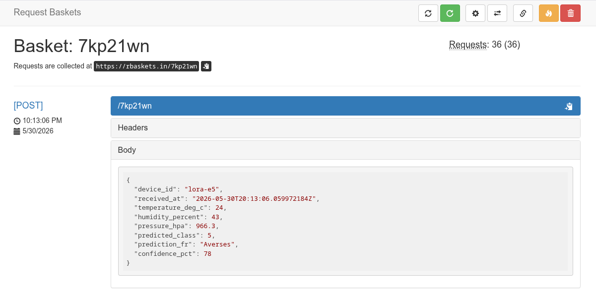

### **Node-RED Integration**  

A Node-RED flow subscribes to the TTN application uplink topic, receives the decoded JSON payload, and performs an HTTP POST to an InfluxDB database, the data is then forwarded to a backend API endpoint. This allows us to easily forward the data to any downstream service (database, dashboard, alerting system) without coupling it directly to the STM32 firmware. The flow is simple:  
1. **TTN Uplink** node listens for incoming messages from TTN.  
2. **HTTP Request** node sends the payload to the API endpoint (`/uplink`) for storage and further processing.  
3. **Debug** node allows monitoring the flow and inspecting the payload in Node-RED.

    

Once decoded by TTN, the data is forwarded to a **Node-RED** flow that performs an HTTP POST to a [Request Baskets](https://rbaskets.in/ "https://rbaskets.in/") endpoint. This makes the payload immediately inspectable from a browser, as shown in the screenshot below, and provides a convenient webhook URL that any downstream service can subscribe to.  

    

 
**Note on the network side:** Routing, cloud dashboards, and persistent storage fall outside our electronics/embedded speciality, so we kept the network stack intentionally minimal and modular. In practice, Node-RED already emits a complete JSON payload (`device_id`, timestamp, sensors, prediction), so the ingestion layer can be swapped without touching the STM32 firmware. We currently run a lightweight Docker setup with a FastAPI service for `/uplink` ingestion and `/stats` exposure, plus a Streamlit dashboard for visualization; adding another backend (InfluxDB/TimescaleDB) or another frontend (Grafana/Datacake) is therefore mostly a wiring/configuration task.  

    

The server receives uplinks from Node-RED, stores each sample in a local NoSQL database, fetches real weather from Open-Meteo for comparison, then serves both raw history and aggregate metrics to the dashboard. This gives a full end-to-end pipeline (sensor -> TTN -> Node-RED -> Database -> API -> dashboard) while keeping deployment simple and reproducible with Docker Compose.  