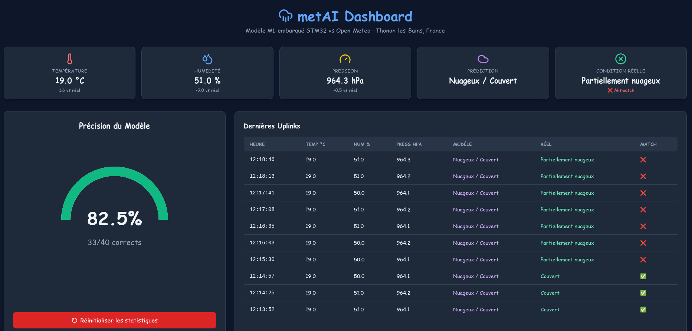

### **Node-RED Integration**  

A Node-RED flow acts as the middleware between The Things Network (TTN) and our local backend services. It subscribes to the TTN application uplink topic, processes the decoded JSON payload, and routes it appropriately. This keeps the network stack modular and decoupled from the STM32 firmware. 

The flow operates in two main branches based on the LoRaWAN `f_port`:

1. **Sensors data uplink** When the U545 has finished reading the values from the sensors, the data is sent using LoRaWAN on port 1, the NodeRED queries the database in order to add the new values. 
2. **Sensors data downlink** While we are querying the database, the flow also asks to retrieve the data from 3 and 6 hours ago in order to send them back to the U545 using a LoRaWAN downlink (port 11).
3. **Model prediction uplink** Using the current data and the values from a few hours ago, the U545 sends the model prediction using port 12.

Separing the uplinks using 2 different ports allows us to know what we are actually receiving from the U545 board. 
If the data comes from port 1, then we know we are getting sensors values which get displayed in the web app but also sent to the database. Also, if data arrives on port 1, it means the U545 is expecting some data back, knowing this, we can trigger a LoRaWAN downlink. 
Howerver, if the data comes from port 12, then we know this is the prediction of the model along with it's confidence which get displayed in the web app. No need to do a LoRaWAN donwlink or query the database.

    

 
**Note on the network side:** Routing, cloud dashboards, and persistent storage fall outside our electronics/embedded specialty, so we kept the network stack intentionally minimal and modular. We used AI in order to create a JS dashboard in order to display the data from our project, however keep in mind that web development is not the main focus of this project.

    

