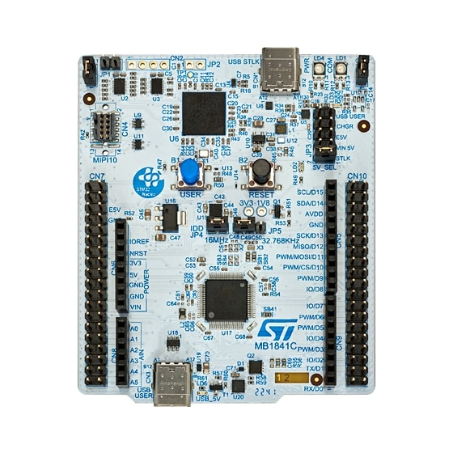
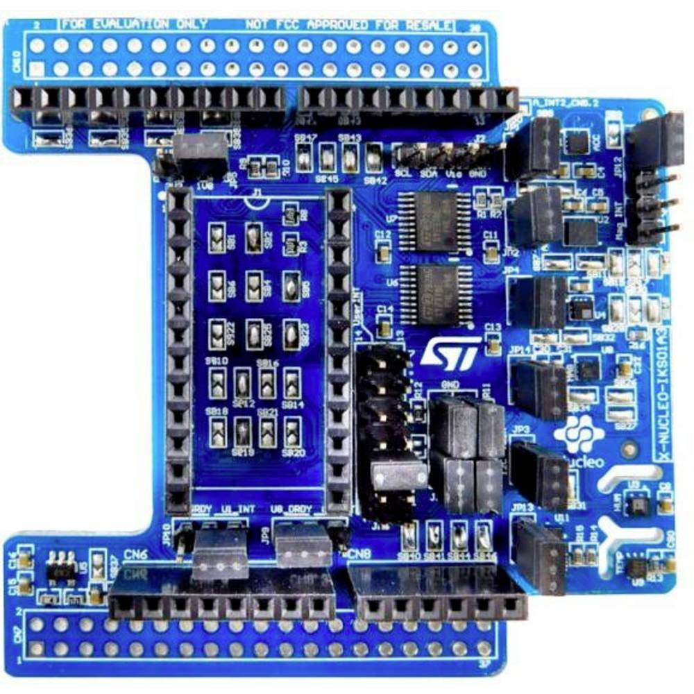
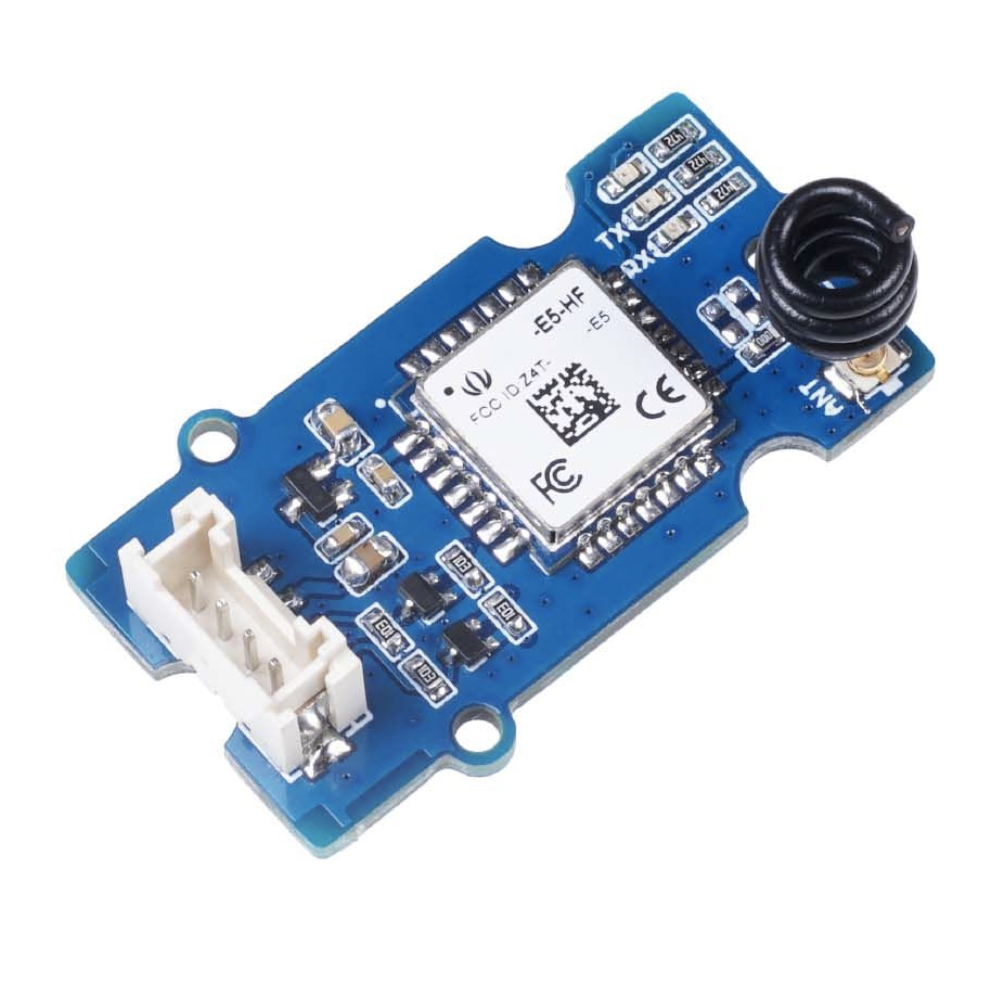
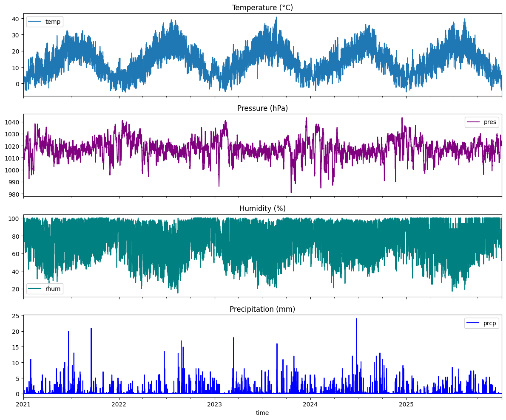
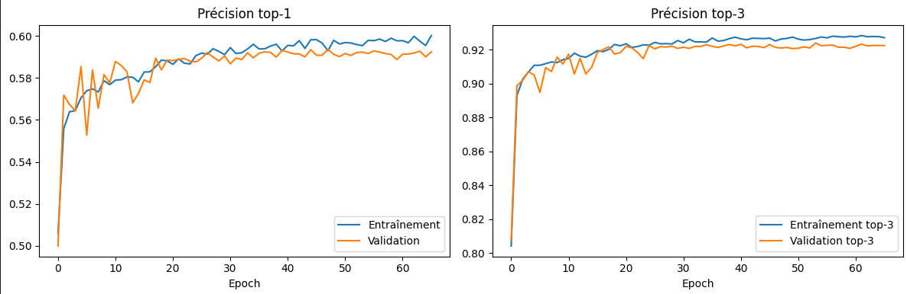
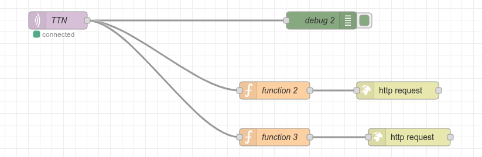
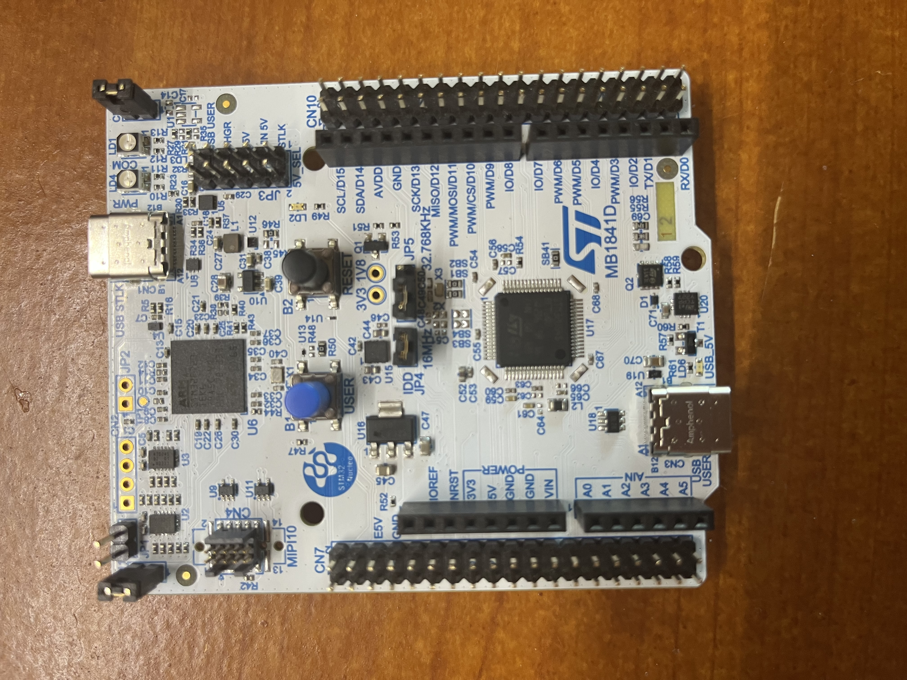
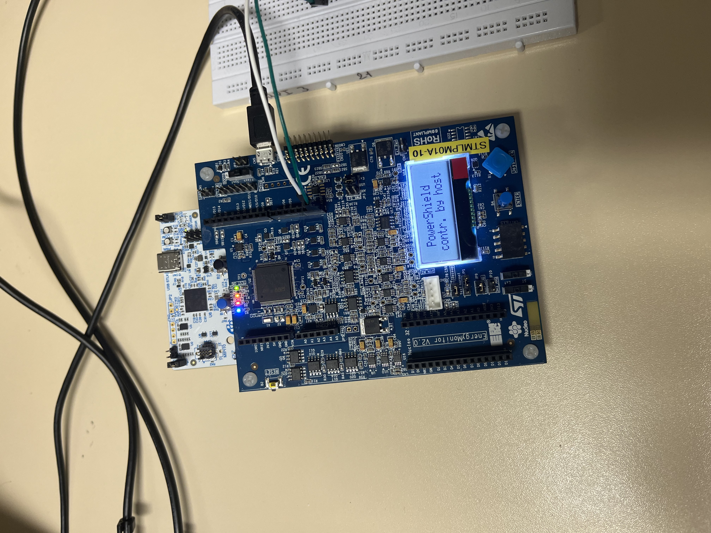
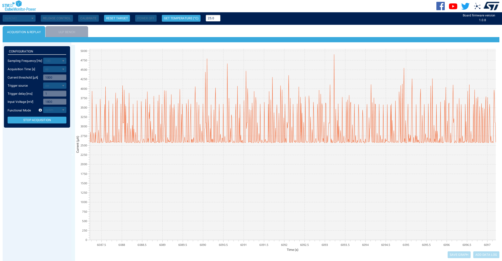

# **🌦️ MetAI — Embedded Weather Prediction with AI on STM32U545**  
**Université Savoie Mont-Blanc** — Licence 3 ESET  
 *Maram Mezlini & Benjamin Avocat-Maulaz*  

<div align="justify">

## **Summary**
- [Introduction](#introduction)
- [Part 1 - Hardware](#part-1-hardware)
- [Part 2 - AI Models](#part-2-ai-models)
- [Part 3 - LoRaWAN](#part-3-lorawan)
- [Part 4 - Power Consumption](#part-4-power-consumption)
- [Part 5 - Conclusion](#part-5-conclusion)
- [Repository Structure](#repository-structure)
- [Build and Flash Workflow](#build-and-flash-workflow)
- [Dependencies](#dependencies)


<a id="introduction"></a>
## **Introduction**  
MetAI is an embedded AI project that runs a weather prediction model directly on an ultra-low-power STM32U545 microcontroller. Using onboard sensors (temperature, humidity, pressure), the system infers the current weather condition locally — no cloud compute required — and transmits the result over LoRaWAN for remote monitoring. The project demonstrates that meaningful AI inference can coexist with strict energy budgets, making it relevant for battery-operated or energy-harvesting IoT nodes.  

<a id="part-1-hardware"></a>
## **Part 1 — Hardware**  
### **STM32U545 — The Microcontroller**  
The brain of the project is the **STM32U545**, a member of STMicroelectronics' ultra-low-power  **STM32U5** family. Key characteristics relevant to this project:  
<table align="center">
	<tr>
		<th>Feature</th>
		<th>Value</th>
	</tr>
	<tr><td>Core</td><td>Arm Cortex-M33, up to 160 MHz</td></tr>
	<tr><td>Flash</td><td>1 MB</td></tr>
	<tr><td>RAM</td><td>786 KB (SRAM1 + SRAM2 + ICACHE)</td></tr>
	<tr><td>Supply voltage</td><td>1.71 V - 3.6 V</td></tr>
	<tr><td>Low-power modes</td><td>Stop 0/1/2/3, Standby, Shutdown</td></tr>
	<tr><td>Neural-ART Accelerator</td><td>Hardware MAC units for AI inference</td></tr>
	<tr><td>Development board</td><td>NUCLEO-U545RE-Q</td></tr>
</table>

The U545's **Neural-ART Accelerator** is what makes on-device AI inference viable at milliwatt-level power: it offloads the multiply-accumulate operations of the neural network from the CPU, dramatically reducing inference time and energy per prediction.  

<p align="center">
	
</p>

### **Extension Board**  
The U545 board is connected to an IKS01A3 extension board. It carries all kind of sensors such as :  
- **temperature (°C)**
- **relative humidity (%)**
- **barometric pressure (hPa)**
The three inputs fed to the AI model.  

<p align="center">
	
</p>

### **LoRa-E5 module** 
Handles the LoRaWAN radio link (see Part 3). 

<p align="center">
	
</p>

<a id="part-2-ai-models"></a>
## **Part 2 — AI Models**  
Both models were trained in Python (TensorFlow/Keras) on historical meteorological data sourced via [Meteostat](https://meteostat.net/ "https://meteostat.net/"), using a weather station near Le Bourget du Lac, France. They take three scalar inputs:  
<table align="center">
	<tr>
		<th>Input</th>
		<th>Unit</th>
	</tr>
	<tr><td>Temperature</td><td>&deg;C</td></tr>
	<tr><td>Relative humidity</td><td>%</td></tr>
	<tr><td>Barometric pressure</td><td>hPa</td></tr>
</table>

<p align="center">
	
</p>

### **Model A — Binary Rain Classifier**  
The first and simpler model answers a single question: **will it rain?** It outputs a sigmoid probability and is thresholded at 0.5 to produce a binary label. This model is extremely lightweight and was used as a baseline to validate the implementation of an AI model on the board. 

### **Model B — Multi-class Weather Classifier**  
The second model extends the output to **12 weather classes**, enabling a richer description of conditions. After training and quantization, it is converted to a TFLite FlatBuffer and deployed on the U545 using  **STM32Cube.AI** with the Neural-ART runtime.  
The 12 predicted classes are:  

<table align="center">
	<tr>
		<th>#</th>
		<th>French label</th>
		<th>Description</th>
		<th>International</th>
	</tr>
	<tr><td>0</td><td>Clair / ensoleillé</td><td>Clear sky</td><td>☀️</td></tr>
	<tr><td>1</td><td>Peu nuageux</td><td>Mostly sunny</td><td>🌤️</td></tr>
	<tr><td>2</td><td>Partiellement nuageux</td><td>Partly cloudy</td><td>⛅</td></tr>
	<tr><td>3</td><td>Nuageux / couvert</td><td>Overcast</td><td>☁️</td></tr>
	<tr><td>4</td><td>Pluie</td><td>Rain</td><td>🌧️</td></tr>
	<tr><td>5</td><td>Averses</td><td>Showers</td><td>🌦️</td></tr>
	<tr><td>6</td><td>Neige</td><td>Snow</td><td>❄️</td></tr>
	<tr><td>7</td><td>Neige légère / averses de neige</td><td>Light snow / snow showers</td><td>🌨️</td></tr>
	<tr><td>8</td><td>Pluie et neige mêlées</td><td>Sleet</td><td>🌨️🌧️</td></tr>
	<tr><td>9</td><td>Orage</td><td>Thunderstorm</td><td>⛈️</td></tr>
	<tr><td>10</td><td>Brouillard / brume</td><td>Fog / mist</td><td>🌫️</td></tr>
	<tr><td>11</td><td>Vent fort</td><td>Strong wind</td><td>💨</td></tr>
	<tr><td>12</td><td>Orage violent</td><td>Severe thunderstorm</td><td>🌩️</td></tr>
</table>

The firmware reads the argmax of the softmax output and encodes both the class index (predicted_class) and its French label (prediction_fr) into the LoRaWAN uplink payload.  

This model does not deliver the highest possible accuracy: predicting upcoming weather conditions from only three instantaneous meteorological measurements, without temporal context, is inherently challenging.
A key improvement would be to include additional temporal features (for example, measurements from the previous hour) to increase predictive reliability. Due to project time constraints, we could not fully validate this approach and therefore kept the current model:

<p align="center">
	
</p>

<a id="part-3-lorawan"></a>
## **Part 3 — LoRaWAN**  

### **What is LoRaWAN?**  
**LoRa** is a spread-spectrum radio modulation developed by Semtech, designed for low-power, long-range communication (up to tens of kilometres in open terrain).  **LoRaWAN** is the MAC layer protocol built on top of LoRa that defines how devices connect to a network of gateways and route packets to an application server. Its key properties for embedded IoT are:  
- Very low transmit power (typically 14–20 dBm)  
- Extremely low device power budget — devices can run for years on a battery  
- Star-of-stars topology: end-nodes → gateways → Network Server (e.g. TTN) → Application Server  

### **Payload Encoding and TTN Decoding**  
On the STM32U545, the uplink payload is encoded as a compact binary frame carrying:  
1. Temperature (signed 16-bit, ×100 for two-decimal precision)  
2. Humidity (unsigned 8-bit, integer %)  
3. Pressure (unsigned 16-bit, integer hPa)  
4. Predicted class index (unsigned 8-bit)  

On **The Things Network (TTN)**, a JavaScript *Payload Formatter* (uplink codec) decodes this binary frame back into a structured JSON object:  
```javascript
function decodeUplink(input) {
  var classesFr = [
    "Clair / ensoleille",
    "Peu nuageux",
    "Partiellement nuageux",
    "Nuageux / couvert",
    "Pluie",
    "Averses",
    "Neige",
    "Neige legere / averses de neige",
    "Pluie et neige melees",
    "Orage",
    "Brouillard / brume",
    "Vent fort",
    "Orage violent"
  ];

  var text = "";
  for (var i = 0; i < input.bytes.length; i++) {
    text += String.fromCharCode(input.bytes[i]);
  }

  var data = {};
  var parts = text.split(",");

  for (var j = 0; j < parts.length; j++) {
    var kv = parts[j].split("=");
    if (kv.length !== 2) continue;

    var key = kv[0].trim();
    var raw = kv[1].trim();

    if (key === "C") {
      var cls = parseInt(raw, 10);
      if (!isNaN(cls)) {
        data.predicted_class = cls;
        data.prediction_fr =
          (cls >= 0 && cls < classesFr.length) ? classesFr[cls] : "Classe inconnue";
      }
      continue;
    }

    var val = parseFloat(raw);
    if (isNaN(val)) continue;

    if (key === "P") data.pressure_hpa = val;
    else if (key === "H") data.humidity_percent = val;
    else if (key === "T") data.temperature_deg_c = val;
    else data[key] = val;
  }

  return {
    data: data
  };
}
```
   
### **Node-RED Integration**  
Once decoded by TTN, the data is forwarded to a **Node-RED** flow that performs an HTTP POST to a [Request Baskets](https://rbaskets.in/ "https://rbaskets.in/") endpoint. This makes the payload immediately inspectable from a browser, as shown in the screenshot below, and provides a convenient webhook URL that any downstream service can subscribe to.  

<p align="center">
	
</p>
 
**Note on the network side:** Routing, cloud dashboards, and persistent storage fall outside our electronics/embedded speciality, so we kept the network stack intentionally minimal. That said, since the full structured JSON is already being POSTed by Node-RED, plugging in a database (InfluxDB, TimescaleDB) or a dashboard (Grafana, Datacake) is straightforward and requires no firmware changes.  

<a id="part-4-power-consumption"></a>
## **Part 4 — Power Consumption**  

### **Why It Matters for AI**  
Neural network inference is inherently compute-intensive. On a general-purpose server, a single forward pass through even a small model draws hundreds of milliwatts. **As an example, a simple google search consumes 0.3 W while a ChatGPT request is 3 W !**  
The U545's Neural-ART accelerator helps significantly: by executing MAC operations in dedicated hardware rather than running them on the Cortex-M33, inference completes faster and at lower energy per operation than a pure software implementation.  

### **Measuring Power Consumption with the LPM01A**  
STMicroelectronics' **X-NUCLEO-LPM01A** (Power Shield) is the reference tool for accurate current measurement on NUCLEO boards. The procedure is as follows:  
1. **Hardware setup:** Remove the IDD jumper on the NUCLEO-U545RE-Q and connect the LPM01A in series on the 3.3 V / VDD supply rail using the dedicated headers.  
2. **Software:** Install  **STM32CubeMonitor-Power** on the host PC and connect to the LPM01A over USB.   
3. **Run the acquisition:** Flash the firmware, trigger a measurement session, and observe the current waveform. STM32CubeMonitor-Power integrates the waveform to give average current, peak current, and total charge (µAh) per acquisition cycle.  

<p align="center">
	
</p>

<p align="center">
	
</p>

### **Measured Power Budget**  
Our system operates at **1.8 V** supply and draws approximately  **3 mA** in the active sensing + inference phase, corresponding to:  
$$P = V \times I = 1.8,\text{V} \times 3,\text{mA} = \mathbf{5.4,mW}$$  
Between acquisitions, the MCU enters a low-power Stop mode, bringing average consumption well below the active peak.  

<p align="center">
	
</p>

<a id="part-5-conclusion"></a>
## **Part 5 — Conclusion**  
This project was an introduction to on-device artificial intelligence in a constrained embedded context. Building and training the models highlighted how much representational power even a small dense network can have — the multi-class classifier reaches solid accuracy using only three sensor inputs. Deploying that model on a Cortex-M33 with a hardware neural accelerator, and watching it produce correct predictions at 5 mW, made the energy argument for edge AI very concrete.  
At the same time, the project reinforced that **energy consumption is a first-class constraint** in embedded AI, not an afterthought. Every design choice — quantization, model depth, duty cycle, supply voltage — has a direct impact on battery life. Future work could explore INT8 quantization (vs the current float32 baseline) and adaptive duty cycling to extend autonomy further.  
More broadly, the number of connected objects in our daily lives keeps growing — smartphones, cars, dishwashers, toothbrushes — and it seems inevitable that AI will progressively find its way into all of them. MetAI is a small but concrete glimpse of what that future could look like: intelligence running locally, efficiently, at the very edge of the network.

<a id="repository-structure"></a>
## **Repository Structure**  
MetAI/  
├── LICENSE  
├── README.md  
├── AI Models/                    # Exported TFLite models  
│   ├── meteo_multiclasse.tflite  
│   └── rain_model.tflite  
├── Binaries/                     # Compiled binaries grouped by test/project  
│   ├── Final project/  
│   ├── First AI model/  
│   └── Simple board test/  
├── Firmwares/                    # STM32CubeIDE firmware projects  
│   ├── implementation_gros_model/  
│   ├── model_IA/  
│   └── test/  
├── Images/                       # Figures used in the README  
│   ├── IKS01A3.png  
│   ├── LoRa-E5.png  
│   ├── U545.jpg  
│   ├── meteostat.png  
│   └── model.png  
├── Jupyter Notebooks/            # Model training/testing notebooks  
│   ├── Model_final.ipynb  
│   └── Model_test.ipynb  
├── NodeRED/                      # Node-RED assets/flows  
└── TTN/                          # TTN payload formatter  
	└── function decodeUplink.txt  
   

<a id="build-and-flash-workflow"></a>
## **Build and Flash Workflow**
- The folders in **Binaries/** contain prebuilt firmware images. They can be directly uploaded to the STM32 board with **STM32CubeProgrammer**.
- The firmware projects in **Firmwares/** are generated with **Makefiles**, so they are not locked to STM32CubeIDE.
- You can open and edit the code in **VS Code**, then build/flash from a terminal with Make commands (including **make flash** when the target is configured).
- This workflow makes it easy to iterate quickly: edit in VS Code, compile with Make, and program either with Make or STM32CubeProgrammer.

<a id="dependencies"></a>
## **Dependencies**  
<table align="center">
	<tr>
		<th>Tool</th>
		<th>Purpose</th>
	</tr>
	<tr><td>STM32CubeIDE</td><td>Firmware development</td></tr>
	<tr><td>STM32Cube.AI / STEdgeAI</td><td>Model conversion and deployment</td></tr>
	<tr><td>TensorFlow / Keras</td><td>Model training</td></tr>
	<tr><td>Meteostat</td><td>Historical weather data</td></tr>
	<tr><td>The Things Network</td><td>LoRaWAN network server</td></tr>
	<tr><td>Node-RED</td><td>Payload forwarding</td></tr>
	<tr><td>STM32CubeMonitor-Power</td><td>Power consumption measurement</td></tr>
</table>
*Université Savoie Mont-Blanc — Licence Électronique et Systèmes Embarqués et Télécommunications (ESET) — 2025/2026*  
   
</div>

