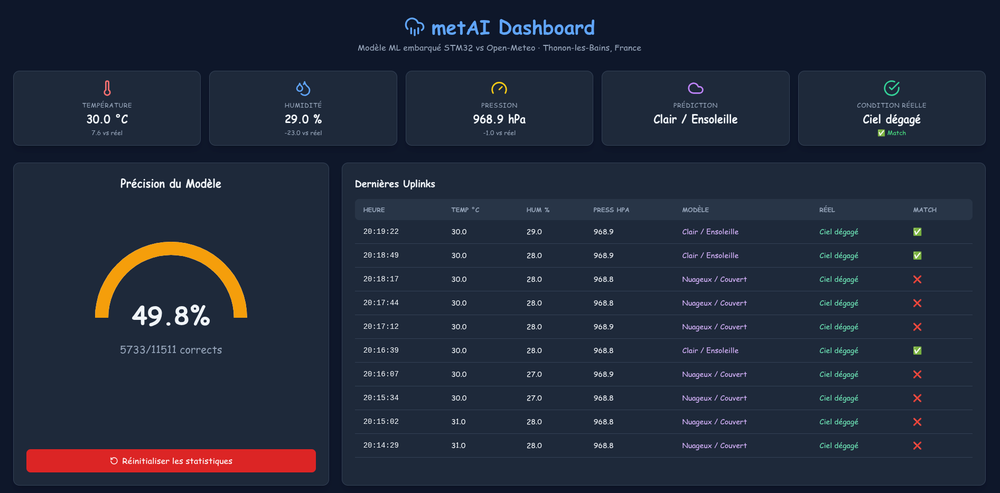
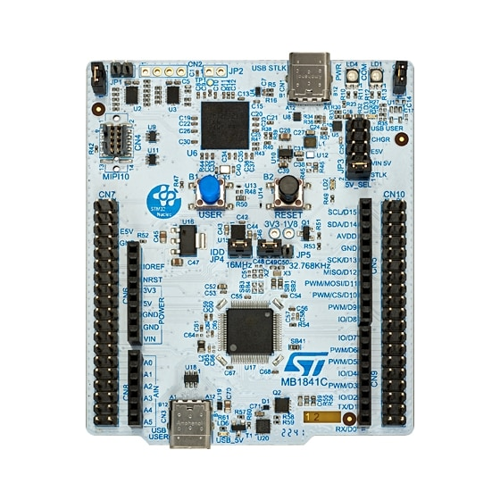
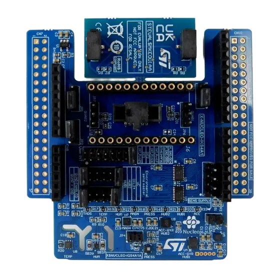
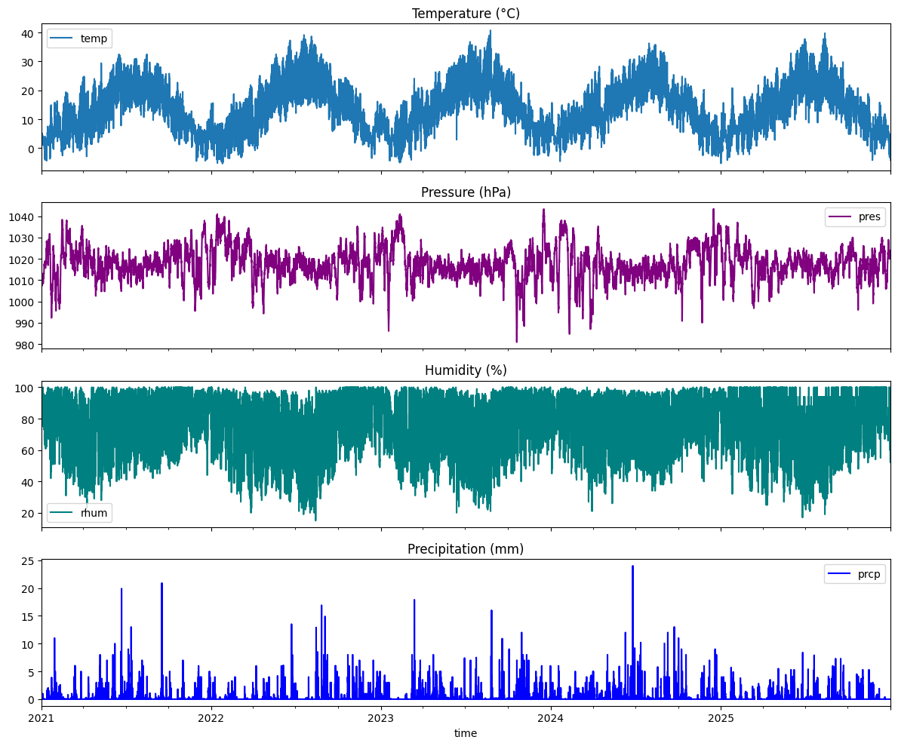
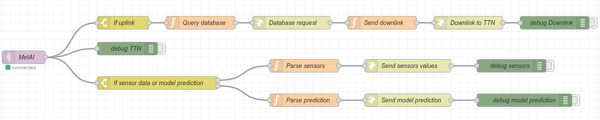
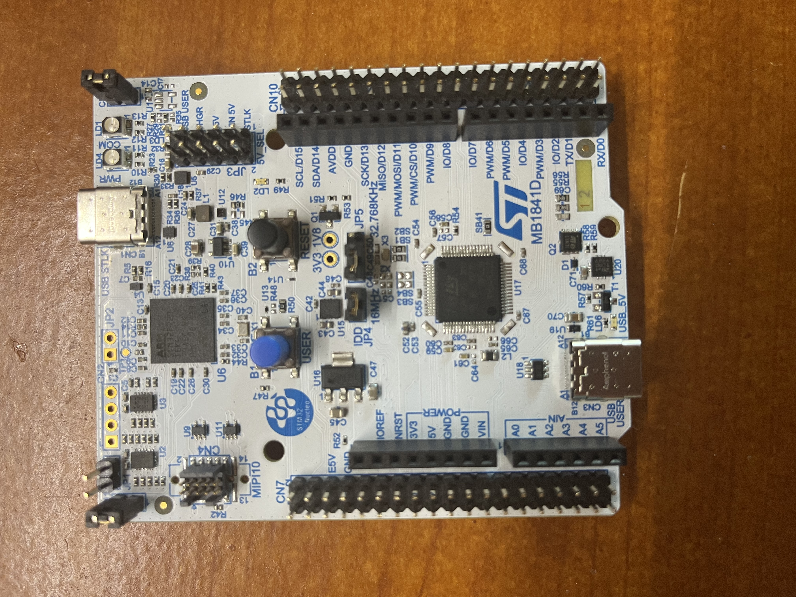
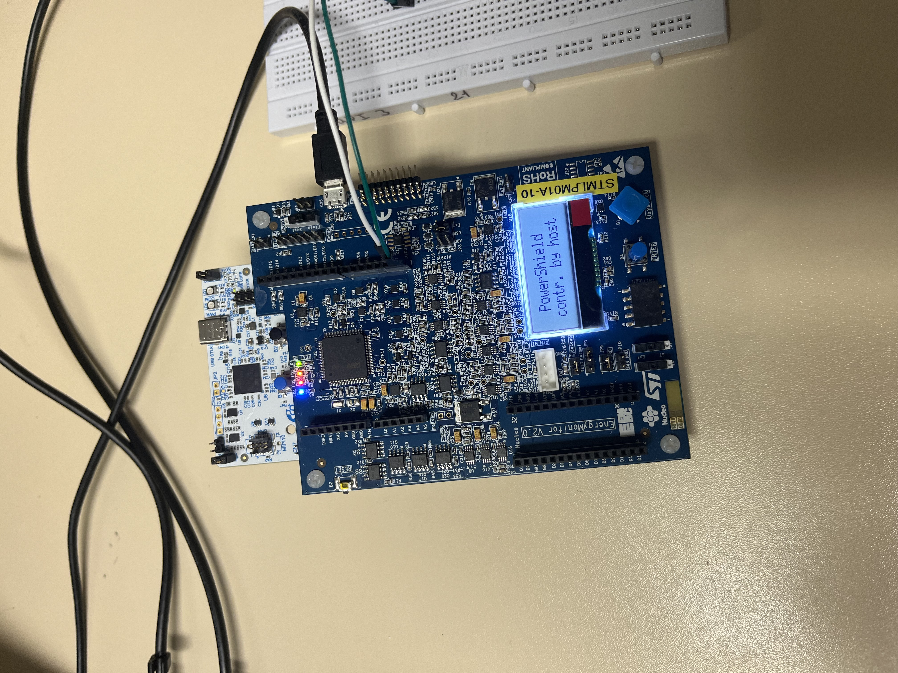
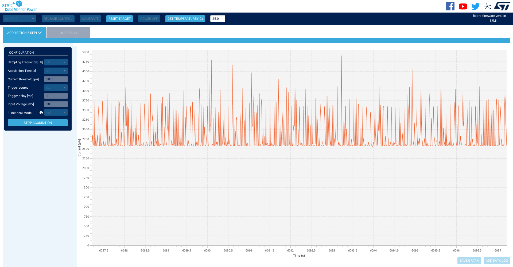

# **🌦️ MetAI — Embedded Weather Prediction with AI on STM32U545**  
**Université Savoie Mont-Blanc** — Licence 3 ESET  
 *Maram Mezlini & Benjamin Avocat-Maulaz*  

<div align="justify">

## **Summary**
- [Introduction](#introduction)
- [How does the project actually works ?](#how-does-the-project-actually-works-?)
- [Part 1 - Hardware](#part-1-hardware)
- [Part 2 - AI Models](#part-2-ai-models)
- [Part 3 - LoRaWAN](#part-3-lorawan)
- [Part 4 - Power Consumption](#part-4-power-consumption)
- [Part 5 - Conclusion](#part-5-conclusion)
- [Repository Structure](#repository-structure)
- [Complete Project Implementation](#complete-project-implementation)
- [Dependencies](#dependencies)


<a id="introduction"></a>
## **Introduction**  
MetAI is an embedded AI project that runs a weather prediction model directly on an ultra-low-power STM32U545 microcontroller. Using onboard sensors (temperature, humidity, pressure), the system infers the current weather condition locally — no cloud compute required — and transmits the result over LoRaWAN for remote monitoring. The project demonstrates that meaningful AI inference can coexist with strict energy budgets, making it relevant for battery-operated or energy-harvesting IoT nodes.  

<a id="How_does_the_project_actually_works_?"></a>
## **How does the project actually works ?**  

The project works the following way : 

On the STM32U545, we read the values of the sensors in order to encode them and send it to the server using LoRaWAN :  
1. Temperature (signed 16-bit, ×100 for two-decimal precision)  
2. Humidity (unsigned 8-bit, integer %)  
3. Pressure (unsigned 16-bit, integer hPa)  

<p align="center">
	
</p>

Once these data are sent, the server is going to store the data inside an InfluxDB database. Additionally, the server is also going to answer to the U545 using a LoRaWAN downlink and send the values of the sensors 3 hours ago and 6 hours ago.

<p align="center">
	
</p>

Back on the U545, the AI model will then make a prediction based on the current values measured by the sensors but also using the values of 3 and 6 hours ago.
The prediction along with the confidence of the AI model is then sent using LoRaWAN in order for the server to display the prediction inside the JS app.
<p align="center">
	
</p>

<p align="center">
	
</p>

<a id="part-1-hardware"></a>
## **Part 1 — Hardware**  
### **STM32U545 — The Microcontroller**  
The brain of the project is the **STM32U545**, a member of STMicroelectronics' ultra-low-power  **STM32U5** family. Key characteristics relevant to this project:  
<table align="center">
	<tr>
		<th>Feature</th>
		<th>Value</th>
	</tr>
	<tr><td>Core</td><td>Arm Cortex-M33, up to 160 MHz</td></tr>
	<tr><td>Flash</td><td>1 MB</td></tr>
	<tr><td>RAM</td><td>786 KB (SRAM1 + SRAM2 + ICACHE)</td></tr>
	<tr><td>Supply voltage</td><td>1.71 V - 3.6 V</td></tr>
	<tr><td>Low-power modes</td><td>Stop 0/1/2/3, Standby, Shutdown</td></tr>
	<tr><td>Development board</td><td>NUCLEO-U545RE-Q</td></tr>
</table>

The U545's **Neural-ART Accelerator** is what makes on-device AI inference viable at milliwatt-level power: it offloads the multiply-accumulate operations of the neural network from the CPU, dramatically reducing inference time and energy per prediction.  

<p align="center">
	
</p>

### **Extension Board**  
The U545 board is connected to an IKS4A1 extension board. It carries all kind of sensors such as :  
- **temperature (°C)**
- **relative humidity (%)**
- **barometric pressure (hPa)**
The three inputs fed to the AI model.  

<p align="center">
	
</p>

### **LoRa-E5 module** 
Handles the LoRaWAN radio link (see Part 3). 

<p align="center">
	
</p>

<a id="part-2-ai-models"></a>
## **Part 2 — AI Models**  
All the models were trained in Python (TensorFlow/Keras) on historical meteorological data sourced via [Meteostat](https://meteostat.net/ "https://meteostat.net/"), using a weather station near Thonon les Bains, France. They take three scalar inputs:  
<table align="center">
	<tr>
		<th>Input</th>
		<th>Unit</th>
	</tr>
	<tr><td>Temperature</td><td>&deg;C</td></tr>
	<tr><td>Relative humidity</td><td>%</td></tr>
	<tr><td>Barometric pressure</td><td>hPa</td></tr>
</table>

<p align="center">
	
</p>

<a id="part-3-lorawan"></a>
## **Part 3 — LoRaWAN**  

<p align="center">
	
</p>

### **What is LoRaWAN?**  
**LoRa** is a spread-spectrum radio modulation developed by Semtech, designed for low-power, long-range communication (up to tens of kilometres in open terrain).  **LoRaWAN** is the MAC layer protocol built on top of LoRa that defines how devices connect to a network of gateways and route packets to an application server. Its key properties for embedded IoT are:  
- Very low transmit power (typically 14–20 dBm)  
- Extremely low device power budget — devices can run for years on a battery  
- Star-of-stars topology: end-nodes → gateways → Network Server (e.g. TTN) → Application Server  

### **Payload Encoding and TTN Decoding**  

The project works the following way : 

On the STM32U545, we read the values of the sensors in order to encode them and send it to the server using LoRaWAN :  
1. Temperature (signed 16-bit, ×100 for two-decimal precision)  
2. Humidity (unsigned 8-bit, integer %)  
3. Pressure (unsigned 16-bit, integer hPa)  

The downlink from the server is encoded like this :


Back on the U545, the AI model prediction follows this encoding :


### **Node-RED Integration**  

We use NodeRED in order to manage both the uplinks and the downlinks based on the values sent by the U545 : 

<p align="center">
	
</p>


<a id="part-4-power-consumption"></a>
## **Part 4 — Power Consumption**  

### **Why It Matters for AI**  
Neural network inference is inherently compute-intensive. On a general-purpose server, a single forward pass through even a small model draws hundreds of milliwatts. **As an example, a simple google search consumes 0.3 W while a ChatGPT request is 3 W !**  
The U545's Neural-ART accelerator helps significantly: by executing MAC operations in dedicated hardware rather than running them on the Cortex-M33, inference completes faster and at lower energy per operation than a pure software implementation.  

### **Measuring Power Consumption with the LPM01A**  
STMicroelectronics' **X-NUCLEO-LPM01A** (Power Shield) is the reference tool for accurate current measurement on NUCLEO boards. The procedure is as follows:  
1. **Hardware setup:** Remove the IDD jumper on the NUCLEO-U545RE-Q and connect the LPM01A in series on the 3.3 V / VDD supply rail using the dedicated headers.  
2. **Software:** Install  **STM32CubeMonitor-Power** on the host PC and connect to the LPM01A over USB.   
3. **Run the acquisition:** Flash the firmware, trigger a measurement session, and observe the current waveform. STM32CubeMonitor-Power integrates the waveform to give average current, peak current, and total charge (µAh) per acquisition cycle.  

<p align="center">
	
</p>

<p align="center">
	
</p>

### **Measured Power Budget**  
Our system operates at **1.8 V** supply and draws approximately  **3 mA** in the active sensing + inference phase, corresponding to:  
$$P = V \times I = 1.8,\text{V} \times 3,\text{mA} = \mathbf{5.4,mW}$$  
Between acquisitions, the MCU enters a low-power Stop mode, bringing average consumption well below the active peak.  

<p align="center">
	
</p>

<a id="part-5-conclusion"></a>
## **Part 5 — Conclusion**  
This project was an introduction to on-device artificial intelligence in a constrained embedded context. Building and training the models highlighted how much representational power even a small dense network can have — the multi-class classifier reaches solid accuracy using only three sensor inputs. Deploying that model on a Cortex-M33 with a hardware neural accelerator, and watching it produce correct predictions at 5 mW, made the energy argument for edge AI very concrete.  
At the same time, the project reinforced that **energy consumption is a first-class constraint** in embedded AI, not an afterthought. Every design choice — quantization, model depth, duty cycle, supply voltage — has a direct impact on battery life.
More broadly, the number of connected objects in our daily lives keeps growing — smartphones, cars, dishwashers, toothbrushes — and it seems inevitable that AI will progressively find its way into all of them. MetAI is a small but concrete glimpse of what that future could look like: intelligence running locally, efficiently, at the very edge of the network.

<a id="repository-structure"></a>
## **Repository Structure**  
MetAI/  
├── LICENSE  
├── README.md  
├── AI Models/                    # Exported TFLite models  
│   ├── meteo_multiclasse.tflite  
│   └── rain_model.tflite  
├── Binaries/                     # Compiled binaries grouped by test/project  
│   ├── Final project/  
│   ├── First AI model/  
│   └── Simple board test/  
├── Firmwares/                    # STM32CubeIDE firmware projects  
│   ├── implementation_gros_model/  
│   ├── model_IA/  
│   └── test/  
├── Images/                       # Figures used in the README  
│   └── ...  
├── Jupyter Notebooks/            # Model training/testing notebooks  
│   ├── Model_final.ipynb  
│   └── Model_test.ipynb  
├── NodeRED/                      # Node-RED assets/flows  
│   └── flows.json  
├── scripts/                      # Utility scripts  
├── Serveur/                      # Backend API + Streamlit dashboard + compose  
│   ├── docker-compose.yml  
│   ├── api/  
│   │   ├── Dockerfile  
│   │   ├── main.py  
│   │   └── requirements.txt  
│   ├── dashboard/  
│   │   ├── app.py  
│   │   ├── Dockerfile  
│   │   └── requirements.txt  
│   └── data/  
└── TTN/                          # TTN payload formatter  
    └── function decodeUplink.txt  
   

<a id="complete-project-implementation"></a>
## **Complete Project Implementation**
This section gives a practical end-to-end sequence to run the full MetAI chain: STM32 board -> LoRaWAN (TTN) -> Node-RED -> server API/dashboard.

### **1) Clone the repository**
```bash
git clone https://github.com/MetAI/MetAI.git
cd MetAI
```

### **2) Flash the binaries on the STM32U545 board**
This project supports two flash paths:
- **Prebuilt binaries** from **Binaries/** for fast deployment.
- **Build + flash** from **Firmwares/** when you modify the source code.

The firmware projects in **Firmwares/** are generated with **Makefiles**, so you can work from **VS Code** and a terminal (not only STM32CubeIDE).

If you want to compile from source before flashing:
1. Go to the target firmware folder (example):
	- `cd Firmwares/implementation_gros_model`
2. Build:
	- `make -j`
3. Flash with Make (when target is configured):
	- `make flash`

To flash a prebuilt image with STM32CubeProgrammer:
1. Connect the NUCLEO-U545RE-Q over USB (ST-LINK).
2. Open **STM32CubeProgrammer** and select **ST-LINK** as the connection type.
3. Pick the firmware image you want from **Binaries/**:
	- **Binaries/Final project/implementation_gros_model.hex** for the complete AI + LoRaWAN project.
	- **Binaries/First AI model/model_IA.hex** for the first AI model test.
	- **Binaries/Simple board test/test.hex** for basic board validation.
4. Program the image, verify flashing, then reset/run the board.
5. Open a serial terminal at **115200 baud** to check runtime logs and LoRa responses.


### **3) Configure the LoRaWAN device**
1. In TTN, create an **Application** and register an **End Device** (OTAA).
2. Keep your device identifiers and keys ready:
	- JoinEUI/AppEUI
	- DevEUI
	- AppKey
3. Provision the LoRa-E5 module once over UART (example AT sequence):
	- `AT`
	- `AT+MODE=LWOTAA`
	- `AT+ID=DevEui,"<YOUR_DEV_EUI>"`
	- `AT+ID=AppEui,"<YOUR_JOIN_EUI>"`
	- `AT+KEY=APPKEY,"<YOUR_APP_KEY>"`
	- `AT+DR=EU868` (or your TTN regional band)
	- `AT+JOIN`
4. Confirm the join is accepted in TTN (Live data).

In this project firmware, uplinks are sent as text payloads through `AT+MSG` in the format:
`P=<pressure>,H=<humidity>,T=<temperature>,C=<predicted_class>`

### **4) Set up the TTN payload formatter function**
1. Open TTN Console -> your Application -> **Payload formatters** -> **Uplink**.
2. Copy/paste the decoder function from:
	- **TTN/function decodeUplink.txt**
3. Save the formatter.
4. Trigger an uplink and verify decoded fields in TTN Live data:
	- `pressure_hpa`
	- `humidity_percent`
	- `temperature_deg_c`
	- `predicted_class`
	- `prediction_fr`

Once this is done, TTN can forward decoded JSON to Node-RED, and Node-RED can POST it to the API `/uplink` endpoint used by the dashboard.

### **5) Mount the server using the Serveur folder**
1. Go to **Serveur/**.
2. Start the stack with Docker Compose:
	- `docker compose up --build -d`
3. Validate services:
	- API on **http://localhost:8000**
	- Dashboard on **http://localhost:8501**
4. Optional checks:
	- `docker compose ps`
	- `docker compose logs -f api`
	- `docker compose logs -f dashboard`

The compose file starts two services:
- **api** (FastAPI ingestion and stats)
- **dashboard** (Streamlit visualization)

<a id="dependencies"></a>
## **Dependencies**  
<table align="center">
	<tr>
		<th>Tool</th>
		<th>Purpose</th>
	</tr>
	<tr><td>STM32CubeIDE</td><td>Firmware development</td></tr>
	<tr><td>STM32Cube.AI / STEdgeAI</td><td>Model conversion and deployment</td></tr>
	<tr><td>TensorFlow / Keras</td><td>Model training</td></tr>
	<tr><td>Meteostat</td><td>Historical weather data</td></tr>
	<tr><td>The Things Network</td><td>LoRaWAN network server</td></tr>
	<tr><td>Node-RED</td><td>Payload forwarding</td></tr>
	<tr><td>STM32CubeMonitor-Power</td><td>Power consumption measurement</td></tr>
	<tr><td>Docker</td><td>Deployment of the web server</td></tr>
</table>
*Université Savoie Mont-Blanc — Licence Électronique et Systèmes Embarqués et Télécommunications (ESET) — 2025/2026*  
   
</div>

