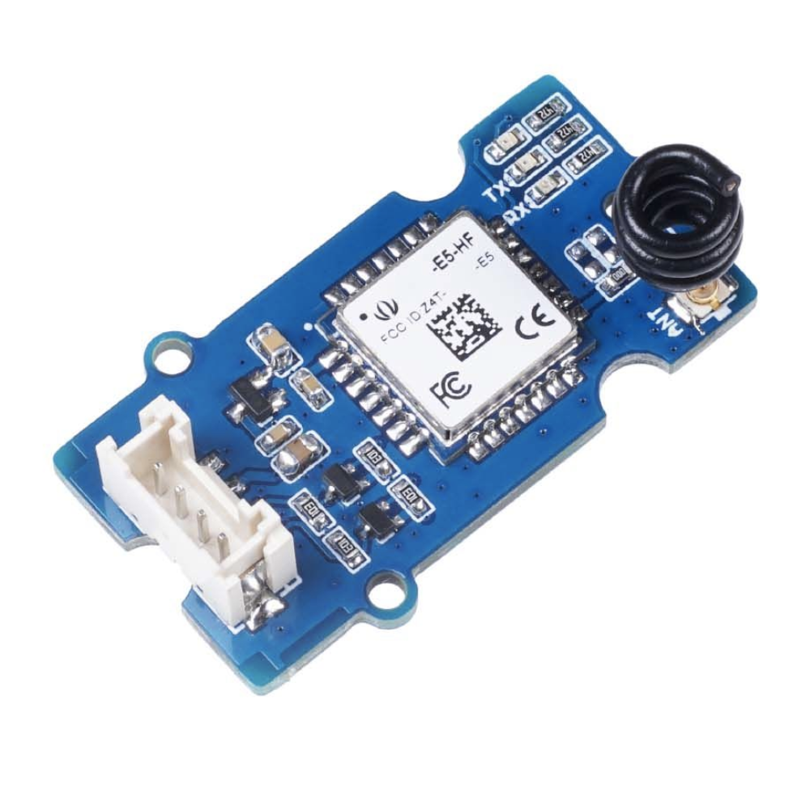

<a id="lorawan"></a>
## **LoRaWAN**  

<p align="center">
  
</p>

### **What is LoRaWAN?**  
**LoRa** is a spread-spectrum radio modulation developed by Semtech, designed for low-power, long-range communication (up to tens of kilometres in open terrain).  **LoRaWAN** is the MAC layer protocol built on top of LoRa that defines how devices connect to a network of gateways and route packets to an application server. Its key properties for embedded IoT are:  
- Very low transmit power (typically 14–20 dBm)  
- Extremely low device power budget — devices can run for years on a battery  
- Star-of-stars topology: end-nodes → gateways → Network Server (e.g. TTN) → Application Server  

### **Payload Encoding and TTN Decoding**  
On the STM32U545, the uplink payload is encoded as a compact binary frame carrying:  
1. Temperature (signed 16-bit, ×100 for two-decimal precision)  
2. Humidity (unsigned 8-bit, integer %)  
3. Pressure (unsigned 16-bit, integer hPa)  
4. Predicted class index (unsigned 8-bit)  

On **The Things Network (TTN)**, a JavaScript *Payload Formatter* (uplink codec) decodes this binary frame back into a structured JSON object:  
```javascript
function decodeUplink(input) {
  var bytes = input.bytes;

  // Byte 0 : température (int8, signé)
  var temperature = (bytes[0] & 0x80) ? bytes[0] - 256 : bytes[0];

  // Bytes 1-2 : pression (int16 big-endian, x10) → hPa
  var pressure_raw = (bytes[1] << 8) | bytes[2];
  if (pressure_raw & 0x8000) pressure_raw -= 65536;
  var pressure = pressure_raw / 10.0;

  // Byte 3 : humidité (uint8, %)
  var humidity = bytes[3];

  // Byte 4 : classe prédite (0-12)
  var class_idx = bytes[4];

  // Byte 5 : confiance (0-100 %)
  var confidence = bytes[5];

  var classes = [
    "Clair / ensoleillé",
    "Peu nuageux",
    "Partiellement nuageux",
    "Nuageux / couvert",
    "Pluie",
    "Averses",
    "Neige",
    "Neige légère / averses de neige",
    "Pluie et neige mêlées",
    "Orage",
    "Brouillard / brume",
    "Vent fort",
    "Orage violent"
  ];

  var weather = (class_idx < classes.length) ? classes[class_idx] : "Inconnu";

  return {
    data: {
      temperature_C:    temperature,
      pressure_hPa:     pressure,
      humidity_pct:     humidity,
      weather_class:    class_idx,
      weather_label:    weather,
      confidence_pct:   confidence
    },
    warnings: [],
    errors: []
  };
}

```